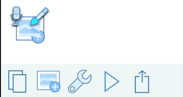

# Readme for AnimatingComponentsIntoView

This is some menu animation I’ve done to show users who tapped an icon (on a previous screen) where the different tools end up. The icon which _explodes_ into moving pieces is in that position on the original screen, with a few other icons.

Within Supernova, start the Preview on the MenuFullSizeWithOverlays screen.

Tap the _Composer_ icon, next to the _Compose a message..._ text.

You will see the icon in roughly the same location on the _next screen_ fade and have some of its components disappear down into another icon.

## The Animation Techniques
Looking at the animation inside Supernova Studio, it's mostly a combination of `Translate X` and `Translate Y` to move the pieces in an apparent curve, down to their final location. The brush also has a little bit of rotation in order to straighten it up.

The vision I had in my head was like playing the old Flight Control game, lining up planes on a path to an airstrip. In particular, I wanted the feel of a smooth curve being followed as a _corridor in the sky_.

## Enhancing the code
It would be preferable if the animations can leave things at the final settings rather than having them return as you see at the end of the gif.

To accomplish that, just edit the generated code looking for the `.fillMode = .removed` and change it to `.fillMode = .forwards`

**But** if you have controls or other gesture-sensing items on the animated shapes, note that this trick will result in them still being apparently active at their _original_ locations.

## Demo of the animation
The following is a screen capture from the 2nd screen, showing how the pieces animate down.

The intent is that they don't then return to the start, as discussed above. That's faked in the demo by setting the Hidden property so they appear to vanish into the destination folder.

The larger animated shows the transition from the previous menu and then the _explosion motion_ playing on entry.

