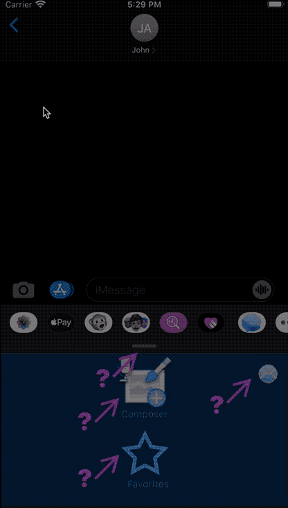

# OnboardingWiggles

Demo archive to accompany an article but useful in its own right. It shows a small help toolkit which can be used to provide help overlays in a standard UIKit app. 

In particular, it shows off some minor animation techniques. Supernova Studio was used to generate the onboarding animation code. Then the code was refined to get to a usable onboarding toolkit. You can see the entire history in this repo starting from the design documents and the initial generated code.

## Background
The attached design shows a small amount of the user interface for [Touchgram][TG] which is an iMessage app available on the [App Store][AS]. An iMessage app has two modes:

1. **Compact Mode** - the active area is the same size as a standard keyboard. In Touchgram, this is always just a menu.
2. **Expanded mode** - the splitter bar expands up towards the top of the screen either by tapping or being dragged. Apple encourage you to have most of your interaction in this size unless you have a very simple app.

The roles of the splitter bar and the different screen sizes were confusing early users so some _onboarding_ was needed. However, unlike most onboarding you see in apps, it had to start confined within the _Compact Mode_ screen and couldn't take over the entire display.

## The Design
There are extra screens in there used whilst working out some design issues - I took screenshots of the current app and added annotation on top.

### Artboards used for importing into Supernova Studio

- `MenuMockupWithArrows` - Combines a screenshot with three icons for buttons, on top of a panel at the bottom representing the iMessage compact screen size. Help buttons and arrows to animate are on top
- `ExpandedView` dummy screen again using a screenshot background with a few help buttons and arrows
- `ShowHelp` contains just the help panel to be displayed on top of the other screens

### Wiggle Animation
Animation was only designed for one image with the intent of making the code more reusable.

As you can see in the timeline, it has a diagonal movement, by adjusting X and Y to the same amount at the same time, then a _wiggle_ by rotating back and forth on the Z axis.

## Code

Code was generated using the xib style for UI with Swift 5, from Supernova Studio v8.5.

See the file `./OnBoardingDesign/OnBoardingWigglesCodeChangeDiary.txt` for details of changes after code generation.

## Playing the Demo

**Important** the demo sizing only works on an iPhone Plus8 simulator. The bottom tab on the expanded background image is sized for that 5.5" phone (this **is** just a quick demo). It will actually work on any size device but the background stuff will be in the wrong place relative to the arrows. In the real [Touchgram app][TG], the help is located relative to active buttons or the edge of screen. 

- The demo starts with a mock screen with the Composer button below being live. 
- The "app" button (Touchgram logo) on the upper right toggles Help visibility, for the purpose of this demo
- Tapping Composer shows a mock expanded _document_ screen
- Tapping the splitter bar in the expanded screen returns to the compact menu
- Tapping any Help button will trigger a modal overlay of the help screen
- The More button on the Help overlay dismisses it and launches the associated URL
- Tapping anywhere else on the Help overlay dismisses it with no other action

### Other files in this archive
The `video` folder contains screen recordings and `.gifcask` files which are the documents of [Gif Brewery 3][GB] which was used to generate the gifs. The videos are longer than the gifs.

The `img` folder contains screenshots and gifs showing the interface in action.

-------
## Reusing this Code

- The tips are all initially hidden in the xib so the state can be updated in `viewDidLoad` and they will appear at that point
- Only animation up to right and down to left is provided at present but you can easily implement your own (I **really** recommend using Supernova Studio to generate the animation code)
- Tip locations are mostly hardcoded in this example

[AS]: https://apps.apple.com/us/app/touchgram-for-imessage/id1447336478#?platform=messages
[TG]: https://www.touchgram.com/
[GB]: https://gfycat.com/gifbrewery