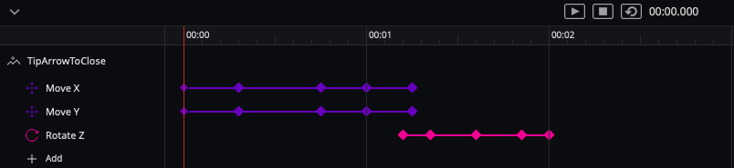

# OnboardingWiggles

Using Supernova Studio to generate the onboarding animation code. Then refining the code to get to a usable onboarding toolkit.

## Background
The attached design shows a small amount of the user interface for [Touchgram][TG] which is an iMessage app available on the [App Store][AS]. An iMessage app has two modes:

1. **Compact Mode** - the active area is the same size as a standard keyboard. In Touchgram, this is always just a menu.
2. **Expanded mode** - the splitter bar expands up towards the top of the screen either by tapping or being dragged. Apple encourage you to have most of your interaction in this size unless you have a very simple app.

## The Design
There are extra screens in there used whilst working out some design issues - I took screenshots of the current app and added annotation on top.

### Artboards used for importing into Supernova Studio

- `MenuMockupWithArrows` - Combines a screenshot with three icons for buttons, on top of a panel at the bottom representing the iMessage compact screen size. Help buttons and arrows to animate are on top
- `ExpandedView` dummy screen again using a screenshot background with a few help buttons and arrows
- `ShowHelp` contains just the help panel to be displayed on top of the other screens

### Wiggle Animation
Animation was only designed for one image with the intent of making the code more reusable.

As you can see in the timeline, it has a diagonal movement, by adjusting X and Y to the same amount at the same time, then a _wiggle_ by rotating back and forth on the Z axis.

## Code

Code was generated using the xib style for UI with Swift 5, from Supernova Studio v8.5.

See the file `./OnBoardingDesign/OnBoardingWigglesCodeChangeDiary.txt` for details of manual changes.

[AS]: https://apps.apple.com/us/app/touchgram-for-imessage/id1447336478#?platform=messages
[TG]: https://www.touchgram.com/